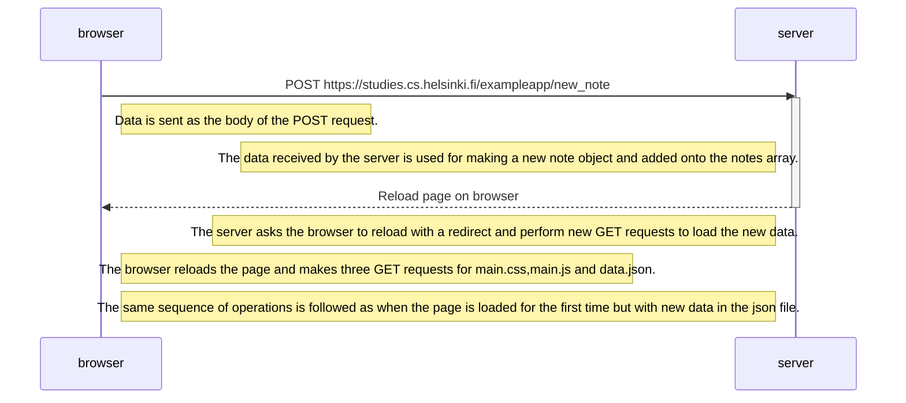

```mermaid
sequenceDiagram
    participant browser
    participant server

    browser->>server: POST https://studies.cs.helsinki.fi/exampleapp/new_note
    activate server
    Note right of browser: Data is sent as the body of the POST request.
    Note left of server: The data received by the server is used for making a new note object and added onto the notes array.
    server-->>browser: Reload page on browser
    deactivate server

    Note left of server: The server asks the browser to reload with a redirect and perform new GET requests to load the new data.
    Note right of browser: The browser reloads the page and makes three GET requests for main.css,main.js and data.json.
    Note right of browser: The same sequence of operations is followed as when the page is loaded for the first time but with new data in the json file.
```