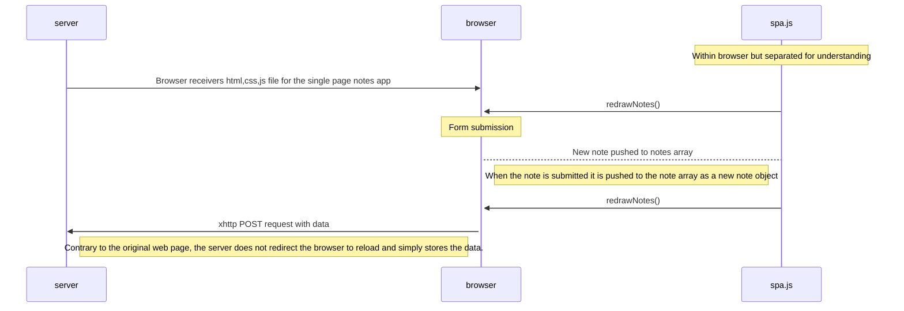

```mermaid
sequenceDiagram
    participant server
    participant browser
    participant spa.js

    note over spa.js: Within browser but separated for understanding

    server->>browser: Browser receivers html,css,js file for the single page notes app
    activate browser
    spa.js ->> browser: redrawNotes()
    Note over browser: Form submission
    browser --> spa.js: New note pushed to notes array
    Note right of browser: When the note is submitted it is pushed to the note array as a new note object
    spa.js ->> browser: redrawNotes()
    browser ->> server: xhttp POST request with data
    Note left of browser: Contrary to the original web page, the server does not redirect the browser to reload and simply stores the data.
```