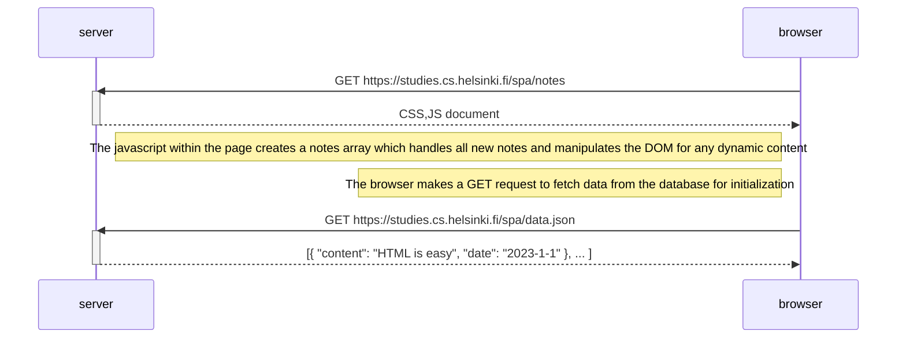

```mermaid
sequenceDiagram
    participant server
    participant browser

    browser->>server: GET https://studies.cs.helsinki.fi/spa/notes
    activate server
    server-->>browser: CSS,JS document
    deactivate server

    Note left of browser: The javascript within the page creates a notes array which handles all new notes and manipulates the DOM for any dynamic content
    Note left of browser: The browser makes a GET request to fetch data from the database for initialization

    browser->>server: GET https://studies.cs.helsinki.fi/spa/data.json
    activate server
    server-->>browser: [{ "content": "HTML is easy", "date": "2023-1-1" }, ... ]
    deactivate server
```