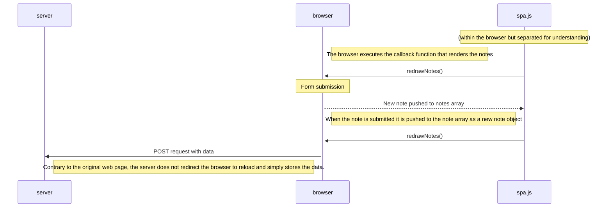

```mermaid
sequenceDiagram
participant server
participant browser
participant spa.js

Note over spa.js: (within the browser but separated for understanding)

Note right of browser: The browser executes the callback function that renders the notes

    activate browser
    spa.js ->> browser: redrawNotes()
    Note over browser: Form submission
    browser -->> spa.js: New note pushed to notes array
    Note right of browser: When the note is submitted it is pushed to the note array as a new note object
    spa.js ->> browser: redrawNotes()
    browser ->> server: POST request with data
    Note left of browser: Contrary to the original web page, the server does not redirect the browser to reload and simply stores the data.

```